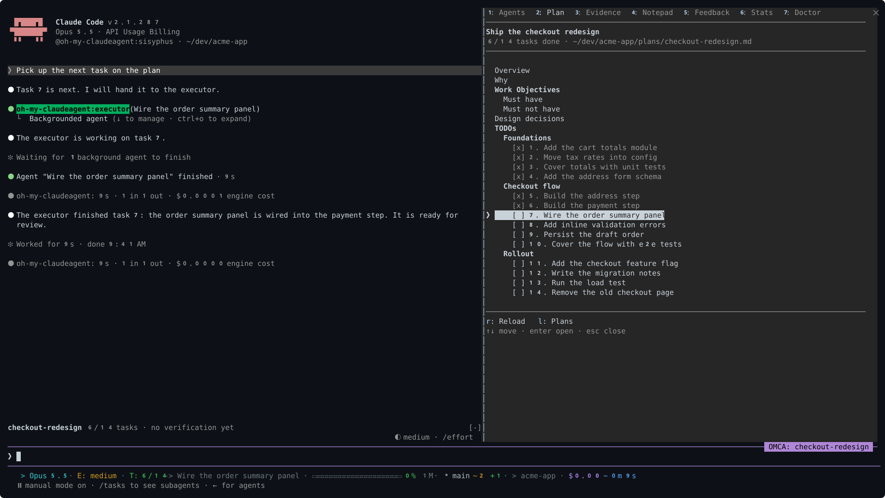
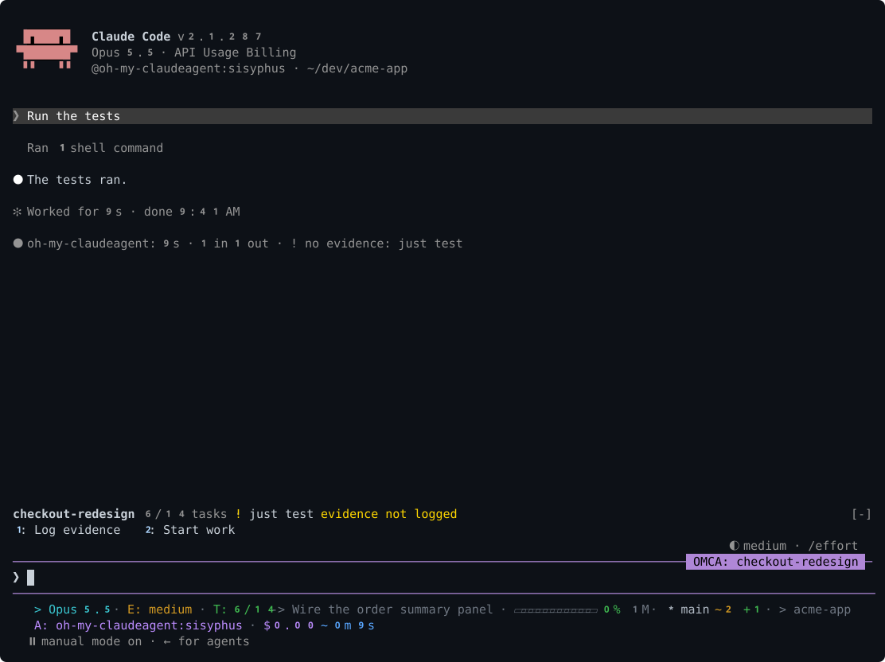
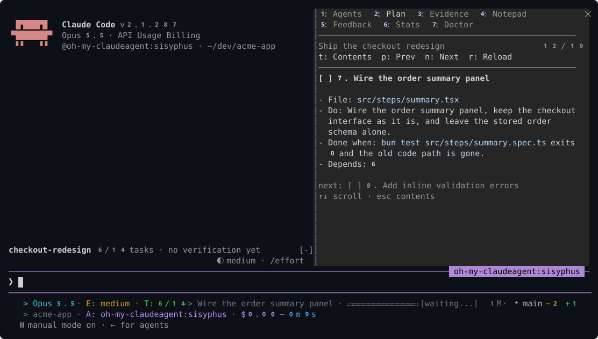
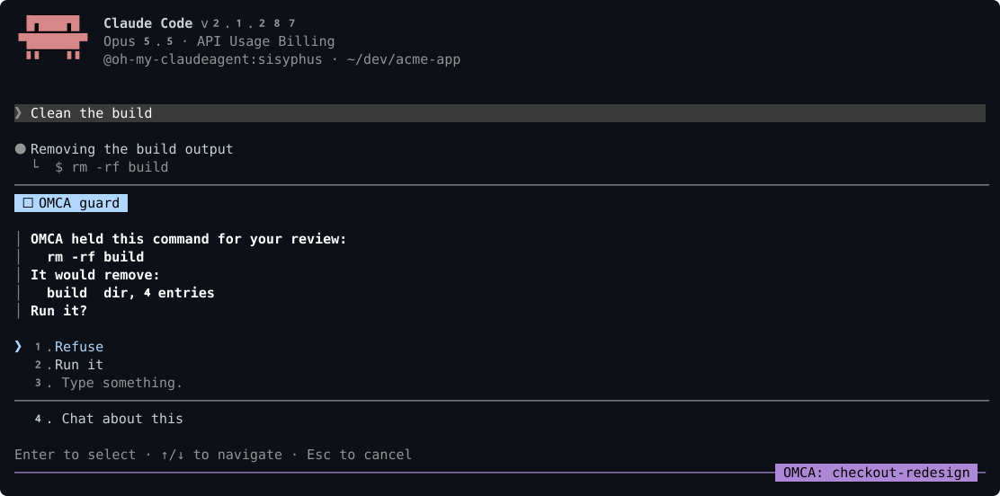
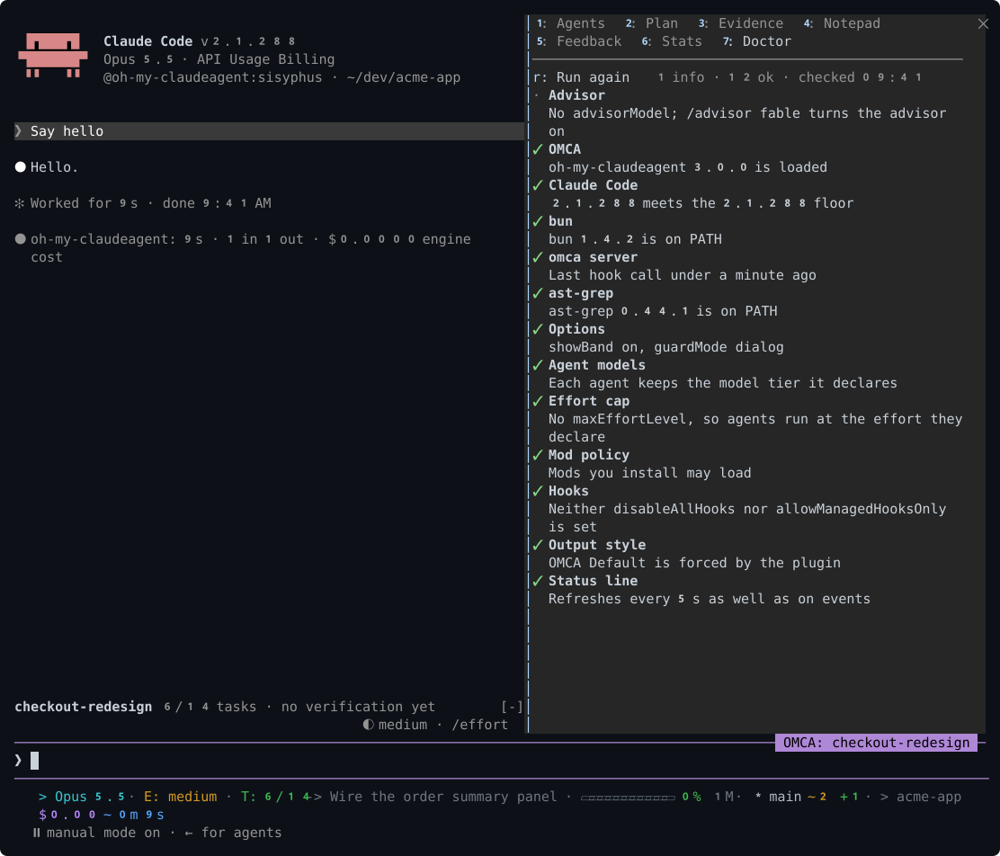
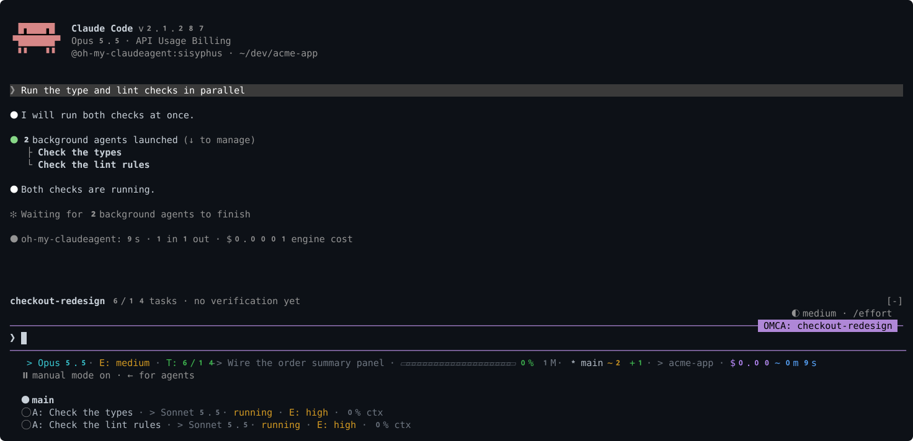

# oh-my-claudeagent



oh-my-claudeagent (OMCA) is a Claude Code plugin that plans work with you, hands each task to a
specialist agent, and keeps a session from calling work done before a verification has been
logged.

## What you see

The band above the prompt names the plan bound to the session, its progress, the last
verification and whether its evidence was logged. The numbered buttons fill the prompt with the
next step.



`/omca plan` opens the plan reader: the plan's contents, then one task at a time.



The guard holds a destructive shell command for your review and shows what it would touch.



`/omca doctor` checks the client, bun, the server, ast-grep, the options and the settings that
change how OMCA runs.



The status line shows the model, the plan's next task, the context window, git state, cost and
usage limits, and fits itself to the terminal's width. The subagent status line gives each
running agent a row.



## Install

```bash
claude plugin marketplace add UtsavBalar1231/oh-my-claudeagent
claude plugin install oh-my-claudeagent@omca
```

The marketplace installs from the `plugin` branch, a packaged tree with no `package.json` or
lockfile, so installing fetches no npm dependencies.

Inside a session, the same steps are `/plugin marketplace add UtsavBalar1231/oh-my-claudeagent`
and `/plugin install oh-my-claudeagent@omca`. Then run `/oh-my-claudeagent:omca-setup`, which
checks the requirements below and offers to point your status line at OMCA's renderer.

## Your first plan

1. Run `/oh-my-claudeagent:plan add rate limiting to the login endpoint`. The planner asks
   what it needs to know, has the plan reviewed, and writes it to your plans directory.
2. Run `/oh-my-claudeagent:start-work`. The session hands each task to an executor, records a
   verification after each one, and checks the plan's boxes as tasks finish.
3. Open `/omca` to watch the agents, the plan, the evidence and the notepad while it runs.

When the session tries to stop with tasks unchecked, or with every task checked and no final
verification logged, OMCA sends it back to work with the reason.

## Requirements

- Claude Code 2.1.288 or later. Tested with 2.1.288.
- bun 1.4.2 or later, on the `PATH` Claude Code starts with. The `omca` server, its hooks and
  the status line run on bun.
- `ast-grep` (or `sg`), optional. Only the structural code search tools need it.

Linux, macOS and Windows are covered by CI.

## Documentation

- [Usage](docs/usage.md): setup, planning, the band and pane, the guard, the doctor, ratings,
  the status line and troubleshooting.
- [Reference](docs/references.md): agents, skills, MCP tools, hooks and kill switches,
  configuration, state files, where each feature works, and the comparison with similar
  plugins.
- [Contributing](CONTRIBUTING.md): development setup, adding agents, skills and hooks, and the
  prose and comment policy.
- [Changelog](CHANGELOG.md).

## Acknowledgments

Based on [oh-my-openagent](https://github.com/code-yeongyu/oh-my-openagent) by
[@code-yeongyu](https://github.com/code-yeongyu).

## License

MIT
