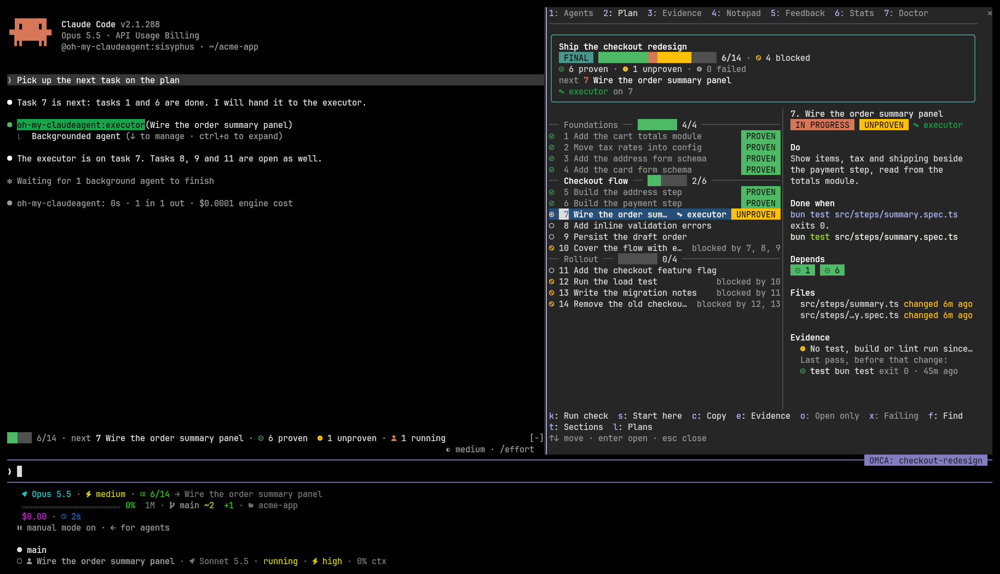
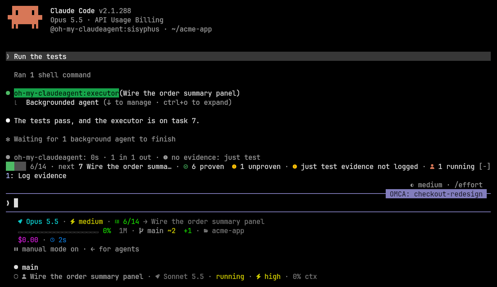
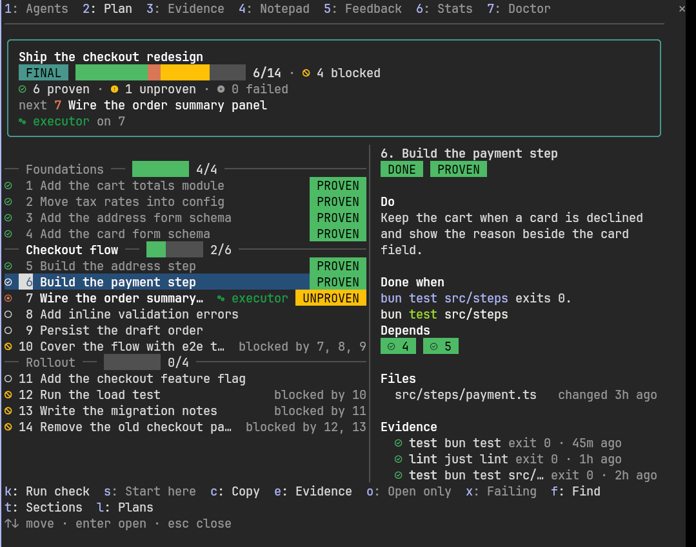
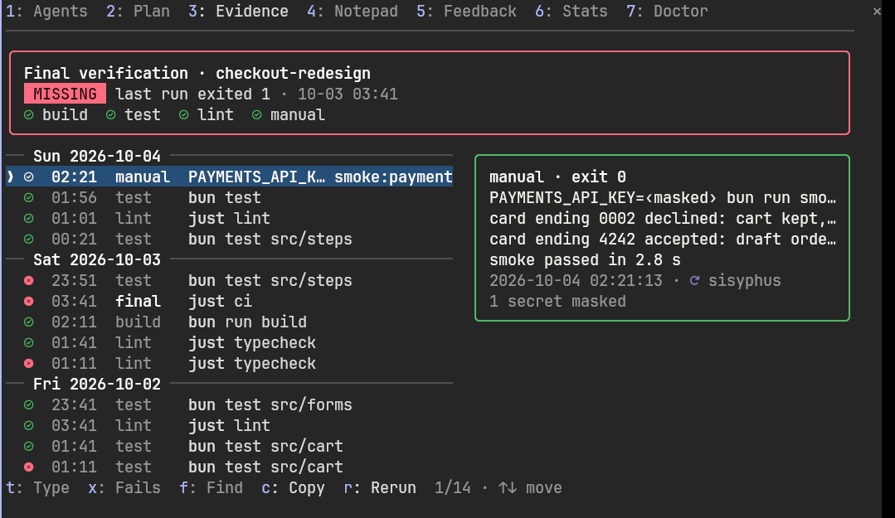
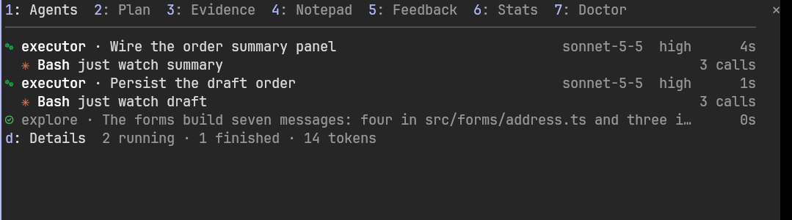
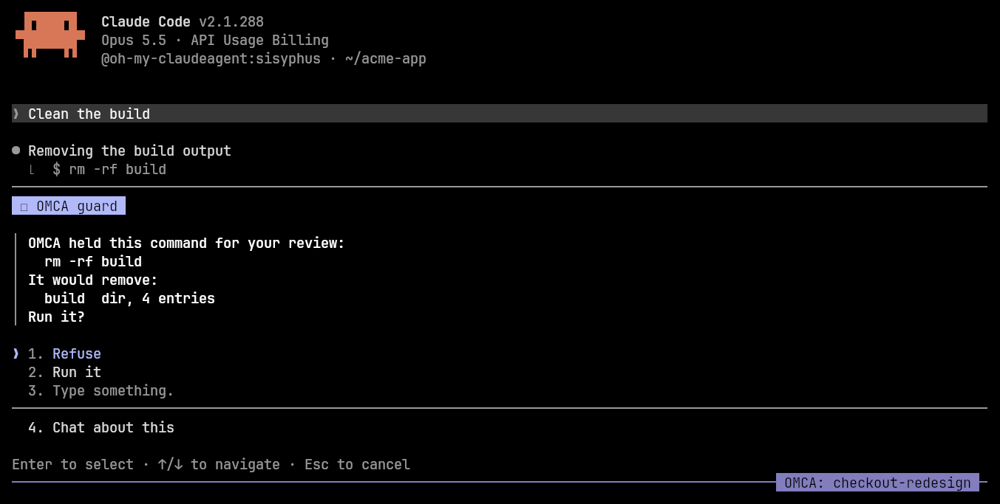
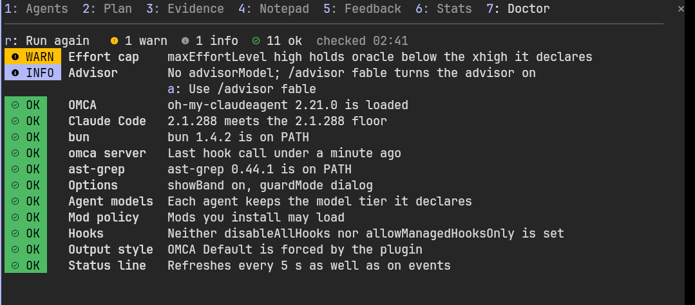
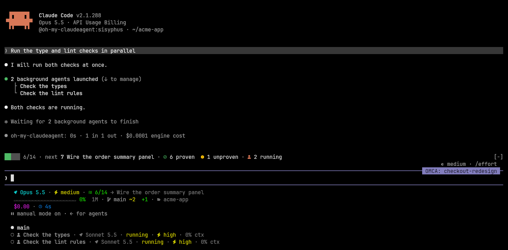
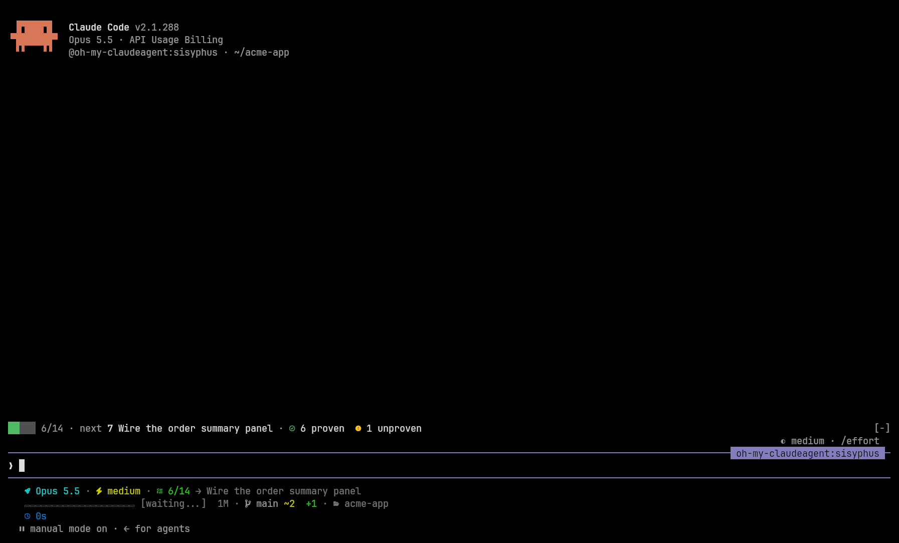
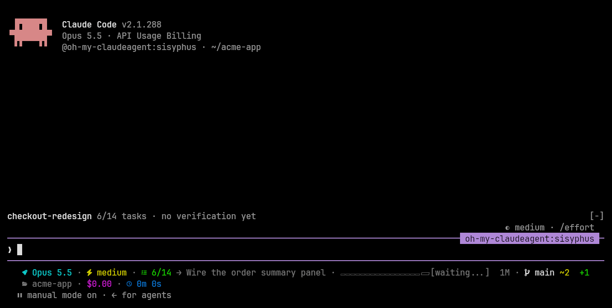

# oh-my-claudeagent

**Claude Code, with receipts.**



oh-my-claudeagent (OMCA) is a Claude Code plugin that plans work with you, hands each task to a
specialist agent, and keeps a session from calling work done before a verification has been
logged.

## Requirements

- Claude Code 2.1.288 or later. Tested with 2.1.288.
- bun 1.4.2 or later, on the `PATH` Claude Code starts with. The `omca` server, its hooks and
  the status line run on bun.
- `ast-grep` (or `sg`), optional. Only the structural code search tools need it.

CI runs on Linux, macOS and Windows.

## Install

```bash
claude plugin marketplace add UtsavBalar1231/oh-my-claudeagent
claude plugin install oh-my-claudeagent@omca
```

The marketplace installs from the `plugin` branch, a packaged tree with no `package.json` or
lockfile, so installing fetches no npm dependencies.

Inside a session, the same steps are `/plugin marketplace add UtsavBalar1231/oh-my-claudeagent`
and `/plugin install oh-my-claudeagent@omca`. Then run `/oh-my-claudeagent:omca-setup`, which
checks the requirements above and offers to point your status line at OMCA's renderer.

## Your first plan

1. Run `/oh-my-claudeagent:plan add rate limiting to the login endpoint`. The planner asks
   what it needs to know, has the plan reviewed, and writes it to your plans directory.
2. Run `/oh-my-claudeagent:start-work`. The session hands each task to an executor, records a
   verification after each one, and checks the plan's boxes as tasks finish.
3. Open `/omca` to watch the agents, the plan, the evidence and the notepad while it runs.

When the session tries to stop with tasks unchecked, or with every task checked and no final
verification logged, OMCA sends it back to work with the reason.

## What you see

The band above the prompt shows the bound plan's progress, the next open task, how many tasks are
proven, unproven and failed, a verification whose evidence was not logged, and how many agents
are running. The numbered buttons fill the prompt with the next step.



`/omca plan` opens the plan board: the tasks grouped by milestone, each with its state, its proof
and the agent working on it. A wide pane shows the focused task's detail beside the list.



The Evidence tab is the proof ledger: a verdict on the plan's final verification, then every
logged run grouped by day.



The Agents tab gives each running subagent a lane with its task, model, effort and current tool
call, and shrinks a finished one to a line.



The guard holds a destructive shell command for your review and shows what it would touch.



`/omca doctor` checks the client, bun, the server, ast-grep, the options and the settings that
change how OMCA runs. A check with a known fix offers a key that fills the prompt with it.



The status line shows the session (model, agent and the plan's next task), the workspace
(context window and git state) and usage (duration, usage limits, and cost for accounts billed
by the token) on rows of their own, and fits itself to the terminal's width. The subagent status
line gives each running agent a row.



In motion: `/omca plan` opens the board, Down moves the focus, Enter opens the task as a page,
and the number keys switch between the pane's tabs.



The guard dialog arrives the moment the model asks for a destructive command.



## Documentation

- [Usage](docs/usage.md): setup, planning, the band and pane, the guard, the doctor, ratings,
  the status line and troubleshooting.
- [Reference](docs/references.md): agents, skills, MCP tools, hooks and kill switches,
  configuration, state files, where each feature works, and the comparison with similar
  plugins.
- [Contributing](CONTRIBUTING.md): development setup, adding agents, skills and hooks, and the
  prose and comment policy.
- [Changelog](CHANGELOG.md).

## Acknowledgments

Based on [oh-my-openagent](https://github.com/code-yeongyu/oh-my-openagent) by
[@code-yeongyu](https://github.com/code-yeongyu).

## License

MIT
